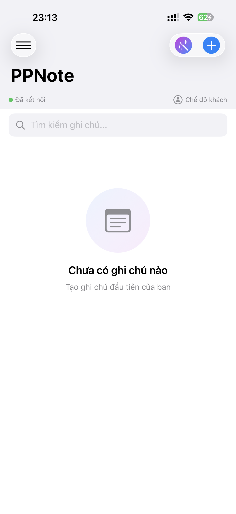
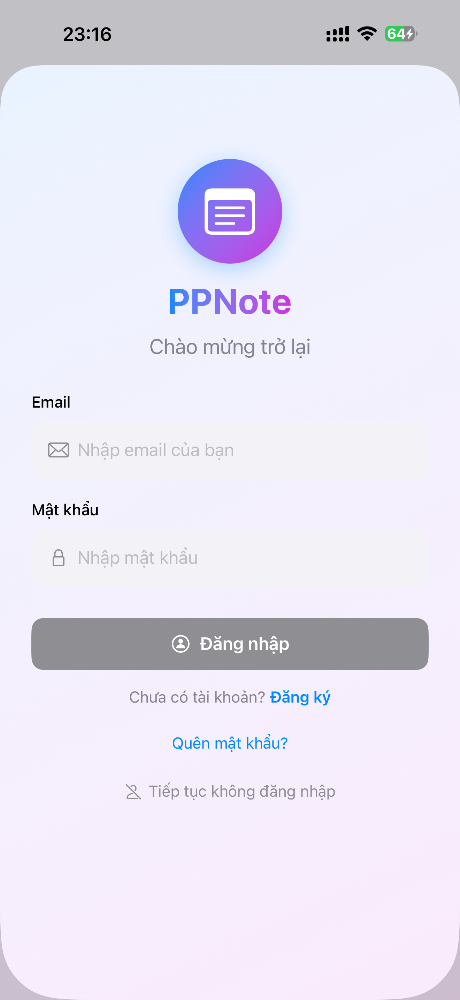

# PPNote - Ứng dụng Ghi Chú Thông Minh

[](https://developer.apple.com/ios/)
[](https://swift.org)
[](LICENSE)

Ứng dụng ghi chú đa tính năng với rich text editor, đồng bộ đám mây, AI image generation, và nhiều tính năng nâng cao khác.

---

## 📱 Một số hình ảnh của ứng dụng

<div align="center">







## </div>

## 📋 Mục Lục

- [Tính Năng](#-tính-năng)
- [Kiến Trúc Ứng Dụng](#️-kiến-trúc-ứng-dụng)
- [Cấu Trúc Thư Mục](#-cấu-trúc-thư-mục)
- [Core Data Model](#-core-data-model)
- [Các Thành Phần Chính](#-các-thành-phần-chính)
- [Utilities](#️-utilities)
- [Views & Components](#-views--components)
- [API Integration](#-api-integration)
- [Cài Đặt](#-cài-đặt)
- [Sử Dụng](#-sử-dụng)

---

## ✨ Tính Năng

### Ghi Chú & Soạn Thảo

- ✍️ **Rich Text Editor** với WebKit
- 🎨 **Định dạng văn bản**: Bold, Italic, Underline
- 📏 **Thay đổi font size** (8-48pt)
- 🎨 **Thay đổi màu chữ**
- 📝 **Danh sách, trích dẫn, đường kẻ ngang**
- 📅 **Chèn ngày tháng & thời gian**
- 🖼️ **Chèn hình ảnh** từ thư viện/camera
- 📊 **Chèn bảng** với tùy chỉnh hàng/cột
- 🧮 **Tự động tính toán** các biểu thức toán học
- 📤 **Xuất & chia sẻ** ghi chú dạng RTF (bao gồm cả hình ảnh embedded)

### Đồng Bộ & Lưu Trữ

- ☁️ **Đồng bộ tự động** với server
- 🔄 **Sync thông minh** - tắt khi đang chỉnh sửa
- 📱 **Offline mode** - làm việc không cần internet
- 💾 **Auto-save** - tự động lưu sau 60s không hoạt động
- 🗑️ **Thùng rác** - khôi phục ghi chú đã xóa
- ⚡ **Real-time sync** - đồng bộ ngay khi có thay đổi

### AI & Nâng Cao

- 🤖 **AI Image Generator** - tạo ảnh từ text prompt
- 🔍 **Tìm kiếm nâng cao** - tìm theo title và content
- 📸 **Camera integration** - chụp ảnh trực tiếp
- 📂 **Import file** - nhập ảnh từ Files app
- 🎯 **Draft mode** - lưu nháp trước khi hoàn thiện
- 🔔 **Thông báo đồng bộ** - toast & system notifications

### Bảo Mật & Xác Thực

- 🔐 **JWT Authentication**
- 👤 **User management**
- 🔑 **Quên mật khẩu** với OTP qua email
- 🔒 **Secure token storage**

---

## 🏗️ Kiến Trúc Ứng Dụng

PPNote được xây dựng theo mô hình **MVVM** (Model-View-ViewModel) với **Core Data** cho local persistence và **REST API** cho cloud sync.

```
┌─────────────────────────────────────────┐
│           SwiftUI Views                 │
│  (NotesListView, UnifiedNoteEditView)   │
└───────────────┬─────────────────────────┘
                │
                ▼
┌─────────────────────────────────────────┐
│         ViewModels & Managers           │
│  (SyncManager, CoreDataManager, etc.)   │
└───────────┬─────────────┬───────────────┘
            │             │
            ▼             ▼
┌───────────────┐   ┌──────────────┐
│  Core Data    │   │  API Service │
│  (Local DB)   │   │  (Backend)   │
└───────────────┘   └──────────────┘
```

---

## 📁 Cấu Trúc Thư Mục

```
PPNote/
├── PPNoteApp.swift                 # App entry point
├── ContentView.swift               # Root view
├── Info.plist                      # App configuration
│
├── Core Managers/
│   ├── CoreDataManager.swift       # Core Data operations
│   ├── SyncManager.swift           # Cloud sync logic
│   ├── AuthManager.swift           # Authentication
│   ├── NetworkManager.swift        # Network monitoring
│   ├── APIService.swift            # REST API client
│   └── AIService.swift             # AI image generation
│
├── PPNoteDataModel.xcdatamodeld/   # Core Data schema
│   └── PPNoteDataModel.xcdatamodel/
│       └── contents                # Entity definitions
│
├── Utilities/
│   ├── EditorPreferences.swift     # User preferences
│
├── Views/
│   ├── LoginView.swift             # Login screen
│   ├── ForgotPasswordView.swift    # Password recovery
│   ├── NotesListView.swift         # Main notes list
│   ├── UnifiedNoteEditView.swift   # Note editor
│   ├── DeletedNotesView.swift      # Trash/recycle bin
│   ├── AIPromptView.swift          # AI image prompt
│   │
│   ├── NoteEditComponents/         # Editor components
│   │   ├── RichTextEditor.swift
│   │   ├── RTFFormatToolbar.swift
│   │   ├── NoteEditorContentView.swift
│   │   ├── NoteEditorToolbarContent.swift
│   │   ├── TitleFieldView.swift
│   │   ├── CalculationResultView.swift
│   │   ├── ImagePickerView.swift
│   │   ├── CameraView.swift
│   │   ├── RTFTableInserter.swift
│   │   ├── AIImageGeneratorView.swift
│   │   ├── UtilityButton.swift
│   │   ├── UtilityToolbarView.swift
│   │   ├── ImportManager.swift
│   │   └── NoteFormattingHelpers.swift
│   │
│   └── NotesListComponents/        # List view components
│       ├── NotesListViewModel.swift
│       ├── NoteCardView.swift
│       ├── EmptyStateView.swift
│       ├── StatusBarView.swift
│       ├── ToastView.swift
│       ├── LeadingToolbarMenu.swift
│       ├── TrailingToolbarButtons.swift
│       └── NotesHelper.swift
│
└── Assets.xcassets/                # App assets
    ├── AccentColor.colorset/
    └── AppIcon.appiconset/
```

---

## 🗄️ Core Data Model

### Entity: `Note`

Ghi chú trong ứng dụng được lưu trữ với các thuộc tính sau:

| Attribute    | Type    | Optional | Description                       |
| ------------ | ------- | -------- | --------------------------------- |
| `id`         | String  | No       | Unique identifier (UUID)          |
| `serverId`   | String  | Yes      | Server-side ID for sync           |
| `title`      | String  | Yes      | Note title                        |
| `content`    | String  | Yes      | HTML content                      |
| `isDraft`    | Boolean | No       | Draft status (default: false)     |
| `tempDelete` | Boolean | No       | Soft delete flag (default: false) |
| `needsSync`  | Boolean | No       | Sync status (default: false)      |
| `createdAt`  | Date    | No       | Creation timestamp                |
| `updatedAt`  | Date    | No       | Last update timestamp             |
| `syncedAt`   | Date    | Yes      | Last sync timestamp               |

### Entity: `User`

Thông tin người dùng:

| Attribute      | Type   | Optional | Description          |
| -------------- | ------ | -------- | -------------------- |
| `id`           | String | No       | User ID              |
| `email`        | String | No       | Email address        |
| `token`        | String | Yes      | JWT token            |
| `lastSyncTime` | Date   | Yes      | Last successful sync |

### Relationships

```
User ←──(1:N)──→ Note
```

Một user có thể có nhiều notes, mỗi note thuộc về một user.

---

## 🧩 Các Thành Phần Chính

### 1. **CoreDataManager**

```swift
class CoreDataManager: ObservableObject
```

**Chức năng:**

- Quản lý persistent store
- CRUD operations cho Note & User
- Fetch notes với các điều kiện (draft, deleted, needs sync)
- Transaction management
- Debug utilities

**Key Methods:**

- `createNote(title:content:isDraft:) -> Note`
- `updateNote(_:title:content:isDraft:allowEmptyTitle:)`
- `fetchAllNotes() -> [Note]`
- `fetchNotesNeedingSync() -> [Note]`
- `deleteNote(_:)` - Soft delete
- `permanentlyDeleteNote(_:)` - Hard delete

---

### 2. **SyncManager**

```swift
class SyncManager: ObservableObject
```

**Chức năng:**

- Đồng bộ notes với server
- Auto-sync every 30 seconds (khi enabled)
- Handle conflicts & merge strategies
- Network-aware syncing
- Disable sync khi đang chỉnh sửa note

**Properties:**

- `@Published var isSyncing: Bool`
- `@Published var lastSyncDate: Date?`
- `@Published var isViewingNote: Bool` - Disable auto-sync khi true

**Key Methods:**

- `performLoginSync()` - Full sync sau khi login
- `performFullSync(fetchAll:)` - Sync toàn bộ
- `syncIfNeeded()` - Sync chỉ khi có thay đổi
- `syncNote(_:)` - Sync một note cụ thể
- `setAutoSyncEnabled(_:)` - Bật/tắt auto-sync

**Sync Flow:**

1. Fetch local notes cần sync
2. Send to server
3. Receive server notes
4. Merge conflicts
5. Update local database
6. Show notification

---

### 3. **AuthManager**

```swift
class AuthManager: ObservableObject
```

**Chức năng:**

- User authentication (login/logout)
- JWT token management
- Session persistence
- Password reset flow

**Properties:**

- `@Published var isLoggedIn: Bool`
- `@Published var currentUser: User?`

**Key Methods:**

- `login(email:password:)`
- `logout()`
- `requestPasswordReset(email:)`
- `verifyOTP(email:code:)`
- `resetPassword(token:newPassword:)`
- `getToken() -> String?`

---

### 4. **APIService**

```swift
class APIService
```

**Chức năng:**

- REST API communication
- Request/Response handling
- Error handling

**Endpoints:**

- **Auth:** `/api/auth/login`, `/api/auth/register`
- **Notes:** `/api/notes`, `/api/notes/:id`
- **Sync:** `/api/notes/sync`
- **Trash:** `/api/notes/trash/all`, `/api/notes/trash/:id/restore`
- **OTP:** `/api/auth/forgot-password`, `/api/auth/verify-otp`

**Key Methods:**

- `login(email:password:) -> LoginResponse`
- `syncNotes(token:notes:lastSyncTime:) -> SyncResponse`
- `createNote(token:id:title:content:isDraft:) -> APINote`
- `updateNote(token:noteId:title:content:isDraft:) -> APINote`
- `deleteNote(token:noteId:)` - Soft delete
- `restoreNote(token:noteId:)`

---

### 5. **NetworkManager**

```swift
class NetworkManager: ObservableObject
```

**Chức năng:**

- Monitor network connectivity
- Handle online/offline states
- Network reachability notifications

**Properties:**

- `@Published var isConnected: Bool`

---

### 6. **AIService**

```swift
class AIService
```

**Chức năng:**

- AI image generation from text prompts
- Integration with AI API
- Image processing & base64 encoding

**Key Methods:**

- `generateImage(prompt:) -> Data?`

---

## 🛠️ Utilities

### 1. **EditorPreferences**

```swift
class EditorPreferences: ObservableObject
```

**Mô tả:** Quản lý preferences của editor (font size, color, etc.)

**Properties:**

- `@Published var lastFontSize: CGFloat` (default: 16)
- Persistent storage với UserDefaults

---

## 🎨 Views & Components

### Main Views

#### 1. **NotesListView**

Danh sách ghi chú chính với các tính năng:

- ✅ Search & filter
- ✅ Pull-to-refresh sync
- ✅ Draft/Published toggle
- ✅ Long press to export/share RTF (bao gồm images embedded)
- ✅ Swipe to delete
- ✅ Toast notifications
- ✅ Empty state

**Components:**

- `NotesListViewModel` - Business logic
- `NoteCardView` - Individual note card
- `StatusBarView` - Sync status indicator
- `ToastView` - In-app notifications
- `EmptyStateView` - Empty list placeholder

---

#### 2. **UnifiedNoteEditView**

Rich text editor với đầy đủ tính năng:

- ✅ WebKit-based WYSIWYG editor
- ✅ Auto-save sau 60s không hoạt động
- ✅ Formatting toolbar (bold, italic, underline)
- ✅ Font size picker (8-48pt)
- ✅ Color picker
- ✅ Insert utilities (list, quote, divider, date, time)
- ✅ Image insertion (camera, library, files)
- ✅ Table insertion
- ✅ AI image generation
- ✅ Math calculation detection
- ✅ Undo/Redo
- ✅ Draft mode

**Components:**

- `TitleFieldView` - Note title input
- `NoteEditorContentView` - Main editor
- `RTFFormatToolbar` - Formatting controls
- `UtilityToolbarView` - Insert utilities
- `CalculationResultView` - Math result display
- `RichTextEditor` - WebView wrapper

---

#### 3. **DeletedNotesView**

Thùng rác - quản lý ghi chú đã xóa:

- ✅ List deleted notes
- ✅ Restore functionality
- ✅ Permanent delete
- ✅ Auto-sync with server trash

---

#### 4. **LoginView**

Màn hình đăng nhập:

- ✅ Email & password validation
- ✅ Remember me
- ✅ Forgot password link
- ✅ Error handling
- ✅ Loading states

---

#### 5. **ForgotPasswordView**

Quên mật khẩu với OTP:

- ✅ Email verification
- ✅ OTP input (6 digits)
- ✅ OTP countdown timer
- ✅ Resend OTP
- ✅ New password setup

---

### Note Edit Components

#### **RichTextEditor**

WebKit-based editor với JavaScript bridge:

- HTML editing với contentEditable
- execCommand cho formatting
- Custom JavaScript functions
- Swift ↔ JavaScript communication

#### **RTFFormatToolbar**

Thanh công cụ định dạng:

- Bold, Italic, Underline buttons
- Font size stepper
- Color picker
- Active state indicators

#### **UtilityToolbarView**

Các tiện ích chèn:

- 📝 List
- 💬 Quote
- ➖ Divider
- 📅 Date
- ⏰ Time
- 🖼️ Image
- 🤖 AI Image
- 📊 Table

#### **RTFTableInserter**

Chèn bảng với tùy chỉnh:

- Rows: 1-10
- Columns: 1-10
- Auto-generate HTML table
- Styled with borders

#### **AIImageGeneratorView**

Tạo ảnh bằng AI:

- Text prompt input
- Loading states
- Preview generated image
- Insert to note

#### **ImagePickerView**

Chọn ảnh từ nhiều nguồn:

- 📸 Camera
- 🖼️ Photo Library
- 📁 Files
- PhotosPicker integration

#### **CameraView**

Camera trực tiếp:

- UIImagePickerController wrapper
- Capture & return image data

---

### Notes List Components

#### **NotesListViewModel**

ViewModel cho NotesListView:

- Fetch & filter notes
- Handle search
- Manage selection
- Sync coordination

#### **NoteCardView**

Card hiển thị từng note:

- Title & content preview (HTML stripped)
- Last update time
- Draft indicator
- Long press menu → "Xuất và chia sẻ RTF"
  - Converts HTML content (including images) to RTF
  - Shows UIActivityViewController for sharing
- Swipe actions (delete)

#### **ToastView**

In-app notification:

- Success/Error states
- Auto-dismiss after 3s
- Slide + fade animation
- Color-coded (green/red)

#### **StatusBarView**

Thanh trạng thái:

- Notes count
- Last sync time
- Sync indicator

#### **EmptyStateView**

Placeholder khi không có notes:

- Icon + message
- Create first note prompt

---

## 🌐 API Integration

### Base URL

```
http://localhost:3102/api
```

### Authentication

Sử dụng JWT Bearer token:

```
Authorization: Bearer <token>
```

### Request/Response Models

#### **LoginResponse**

```swift
struct LoginResponse: Codable {
    let token: String
    let user: UserData
}
```

#### **APINote**

```swift
struct APINote: Codable {
    let id: String
    let title: String
    let content: String?
    let is_draft: Bool
    let temp_delete: Int
    let created_at: String?
    let updated_at: String?
    let synced_at: String?
}
```

#### **SyncResponse**

```swift
struct SyncResponse: Codable {
    let serverNotes: [APINote]
    let conflicts: [Conflict]
}
```

### Sync Strategy

1. **Initial Sync** (Login):

   - Fetch ALL notes from server
   - Merge with local notes
   - Resolve conflicts (server wins)

2. **Auto Sync** (Every 30s):

   - Only if `isAutoSyncEnabled = true`
   - Only if NOT viewing a note
   - Send local changes
   - Fetch server updates since lastSyncTime

3. **Manual Sync** (Pull-to-refresh):

   - Force fetch all notes
   - Update lastSyncTime

4. **Conflict Resolution**:
   - Server timestamp > Local → Server wins
   - Mark local note as needs sync if changed locally

---

## 💾 Cài Đặt

### Yêu Cầu Hệ Thống

- iOS 15.0+
- Xcode 14.0+
- Swift 5.0+

### Dependencies

- SwiftUI
- CoreData
- WebKit
- Combine
- PhotosUI
- UniformTypeIdentifiers
- UserNotifications

### Cài Đặt Backend

1. Clone backend repository
2. Cài đặt dependencies:

   ```bash
   cd APINOTE
   npm install
   ```

3. Configure `.env`:

   ```env
   PORT=3102
   JWT_SECRET=your_secret_key
   DB_HOST=localhost
   DB_USER=root
   DB_PASSWORD=your_password
   DB_NAME=ppnote
   HOST_EMAIL=your_email@gmail.com
   HOST_EMAIL_PASS=your_app_password
   ```

4. Start server:
   ```bash
   npm start
   ```

### Cài Đặt iOS App

1. Clone repository:

   ```bash
   git clone <repository_url>
   cd PPNote
   ```

2. Mở project trong Xcode:

   ```bash
   open PPNote.xcodeproj
   ```

3. Update API endpoint trong `APIService.swift`:

   ```swift
   private let baseURL = "http://YOUR_SERVER_IP:3102/api"
   ```

4. Build & Run (⌘R)

---

## 📱 Sử Dụng

### Đăng Nhập

1. Nhập email & password
2. Tap "Đăng nhập"
3. App sẽ sync toàn bộ notes từ server

### Tạo Ghi Chú Mới

1. Tap nút "+" ở góc trên bên phải
2. Nhập tiêu đề & nội dung
3. Sử dụng toolbar để định dạng
4. Tap "Lưu" hoặc để auto-save

### Định Dạng Văn Bản

- **Bold**: Tap `B` button
- **Italic**: Tap `I` button
- **Underline**: Tap `U` button
- **Font Size**: Sử dụng stepper (+ / -)
- **Color**: Tap color button và chọn màu

### Chèn Nội Dung

- **Image**: Tap 🖼️ → Chọn Camera/Library/Files
- **AI Image**: Tap 🤖 → Nhập prompt → Tạo
- **Table**: Tap 📊 → Chọn rows/columns → Chèn
- **List**: Tap list icon
- **Date/Time**: Tap calendar/clock icon

### Tính Toán Tự Động

Gõ phép tính và app sẽ hiển thị kết quả:

```
10 + 5 * 2 = 20
```

Tap "+" để thêm kết quả vào note.

### Xuất & Chia Sẻ

1. Long press vào note card trong danh sách
2. Chọn "Xuất và chia sẻ RTF"
3. App sẽ convert HTML content → RTF format
4. Tất cả formatting và **hình ảnh được giữ nguyên**
5. Chọn app để chia sẻ (Messages, Mail, Files, etc.)

**Nội dung được xuất:**

- ✅ Text với đầy đủ formatting (bold, italic, underline)
- ✅ Font sizes & colors
- ✅ **Hình ảnh** - Convert từ base64 trong HTML sang RTF image attachments
- ✅ Bảng với borders và structure
- ✅ Danh sách (numbered & bulleted)
- ✅ Trích dẫn & dividers

**Lưu ý:**

- File RTF có thể mở bằng Word, Pages, TextEdit, Google Docs
- Hình ảnh được embed trực tiếp trong file RTF (không cần file riêng)
- Filename tự động lấy từ note title

### Xóa & Khôi Phục

- **Soft Delete**: Swipe left → Delete
- **View Trash**: Menu → "Thùng rác"
- **Restore**: Tap "Khôi phục" trong trash
- **Permanent Delete**: Tap "Xóa vĩnh viễn"

### Đồng Bộ

- **Auto**: Tự động mỗi 30s (khi không đang chỉnh sửa)
- **Manual**: Pull-to-refresh ở NotesListView
- **Force**: Menu → "Đồng bộ ngay"

---

## 🔧 Configuration

### Auto-Save Settings

```swift
// UnifiedNoteEditView.swift
private let autoSaveInactivityInterval: TimeInterval = 60 // 60 seconds
```

### Auto-Sync Interval

```swift
// SyncManager.swift
private func setupAutoSync() {
    syncTimer = Timer.scheduledTimer(
        withTimeInterval: 30, // 30 seconds
        repeats: true
    ) { ... }
}
```

### Font Size Range

```swift
// EditorPreferences.swift
let fontSize = min(max(size, 8), 48) // 8-48pt
```

---

## 🐛 Debugging

### Enable Verbose Logging

App in các logs chi tiết cho:

- Core Data operations
- Sync process
- API requests
- Error handling

Xem logs trong Xcode Console khi chạy app.

### Common Issues

#### Sync Không Hoạt Động

- ✅ Kiểm tra network connection
- ✅ Verify JWT token còn hạn
- ✅ Check server logs
- ✅ Ensure `isViewingNote = false`

#### App Crash Khi Sync

- ✅ Validate Core Data constraints
- ✅ Check for nil values
- ✅ Ensure thread safety (context.perform)
- ✅ Review HTML entity decoding

#### Auto-Save Không Trigger

- ✅ Verify `hasPendingChanges()` returns true
- ✅ Check timer not cancelled
- ✅ Ensure not `isUserTyping`, `isInserting`, or `isFormatting`

---

## 📄 License

MIT License - Xem file [LICENSE](LICENSE) để biết thêm chi tiết.

---

## 👨‍💻 Author

**PP7803**

- Email: duyphat8d@gmail.com
- GitHub: [@pp7803](https://github.com/pp7803)

---

## 🙏 Acknowledgments

- SwiftUI framework by Apple
- WebKit for rich text editing
- Core Data for local persistence
- Express.js for backend API

---

## 📝 Changelog

### Version 1.1.0 (Current)

- ✅ Added RTF export & share functionality
- ✅ Implemented sync notifications (toast + system)
- ✅ Fixed auto-save interference with user editing
- ✅ Added keyboard dismissal on tap outside
- ✅ Removed rich content tag from UI
- ✅ Enhanced sync error handling
- ✅ Disabled auto-sync when viewing notes
- ✅ Fixed HTML entity decoding crashes
- ✅ Improved Core Data thread safety

### Version 1.0.0

- 🎉 Initial release
- ✅ Rich text editor
- ✅ Cloud sync
- ✅ AI image generation
- ✅ Authentication
- ✅ Draft mode
- ✅ Trash/restore

---

## 🚀 Roadmap

### Planned Features

- [ ] Markdown support
- [ ] Tags & categories
- [ ] Note templates
- [ ] Collaboration (shared notes)
- [ ] Dark mode enhancements
- [ ] iPad optimization with multi-column layout
- [ ] Apple Watch companion app
- [ ] iCloud sync (alternative to custom backend)
- [ ] Handwriting recognition
- [ ] Voice notes
- [ ] PDF export
- [ ] Encryption for sensitive notes

---

**© 2025 PPNote. All rights reserved.**
